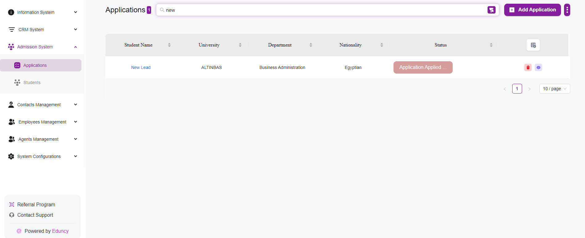
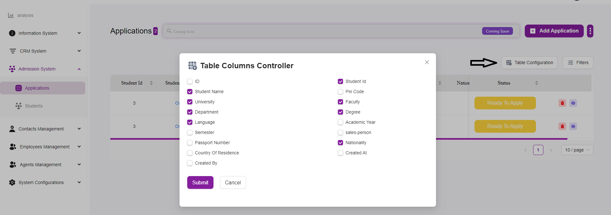

# Applications Listing Overview

The Applications page in your Admission System module provides a comprehensive view of all the student applications. This page is designed to help you manage and track applications efficiently. Here’s a detailed overview of its features and functionalities

---

## Layout and Navigation

### Top Navigation Bar:
- The top bar includes a search field for quickly locating applications based on student names or other criteria.  
- The “Add Application” button allows you to add a new application manually.  
  - For more information on how to add an Application click Here  

### Main Table
The main table on the Applications page displays a list of all student applications.  
Each row in the table represents an individual application and includes the following columns:

- **Student Id:**  
  Displays the unique identifier for each student.  

- **Student Name:**  
  Displays the name of the student.  
  Clicking on the student name may provide more details about the student’s profile.  

- **University:**  
  Displays the name of the university to which the student has applied.  

- **Faculty:**  
  Displays the faculty or school within the university (e.g., Graduate School of Social Science).  

- **Department:**  
  Displays the specific department (e.g., Business Administration, Arts and Design).  

- **Degree:**  
  Displays the degree program (e.g., Master With Thesis).  

- **Language:**  
  Displays the language of instruction for the program.  

- **Nationality:**  
  Displays the nationality of the student.  

- **Status:**  
  Displays the current status of the application (e.g., Ready To Apply).  
  Status buttons are color-coded for easy identification.  

  - You can customize it as you like from the **Table Configuration Button**

---

## Action Buttons
For each application, there are action buttons on the right side of the table:

- **Delete (Trash Can Icon):**  
  Allows you to delete the application.  

- **View (Eye Icon):**  
  Allows you to view detailed information about the application.  

---

## Additional Features

- **Table Configuration:**  
  A button that allows you to configure which columns are displayed in the table.  

- **Filters:**  
  A button that allows you to filter the applications based on various criteria to find specific applications more easily.  

- **Pagination:**  
  Located at the bottom of the table, this allows you to navigate through multiple pages of applications.  
  You can adjust the number of applications displayed per page.  
  
