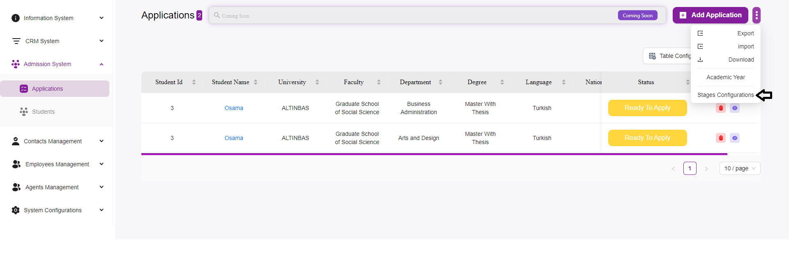
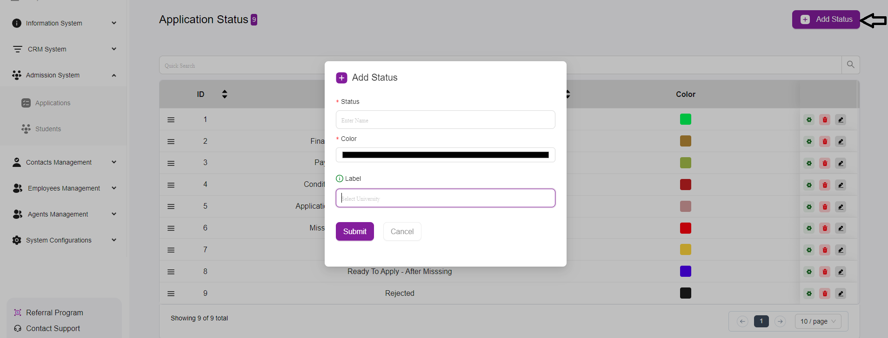

# How to Add Application Stages

The **“Application Status”** management interface allows users to define and manage different stages of the application process.  
This feature is crucial for tracking the progress of applications and providing applicants with up-to-date information about their status.

---

## Steps to Add an Application Stage

### 1. Access the Application Status Section:
- Navigate to the **“Admission System”** in the main menu.  
- Select **“Applications”** and then click the **three dots**, then choose **“Stages Configurations.”**  

### 2. Add a New Status:
- Click the **“Add Status”** button located at the top right corner of the interface.  

### 3. Fill in the Status Details:
A form will appear, allowing you to input the necessary details for the new application stage.

- **Status:**  
  Enter the name of the application status (e.g., *Submitted, Under Review, Accepted*).  
  *This is a required field.*  

- **Color:**  
  Select a color to visually distinguish this status from others.  
  Click on the color box to choose a color from the palette.  
  *This is a required field.*  

- **Label (Optional):**  
  Optionally, you can select the associated university from a dropdown menu, if applicable.  
  This field helps to categorize the status if you manage multiple universities within the system.  

### 4. Submit the Form:
- Once you have filled in the required fields, click the **“Submit”** button to add the new status to the list.  
- If you change your mind, click **“Cancel”** to close the form without saving any changes.  

---

## Managing Existing Statuses

- After adding, the new status will appear in the list along with other existing statuses.  
- Each status has action icons next to it:  
  - **Settings (gear):** Configure the status.  
  - **Pencil:** Edit the status.  
  - **Trash can:** Delete the status.  

---

## Search and Pagination
- Use the **search bar** at the top to quickly find a specific status.  
- Navigate through the pages using the **pagination controls** at the bottom if you have many statuses.  
  
