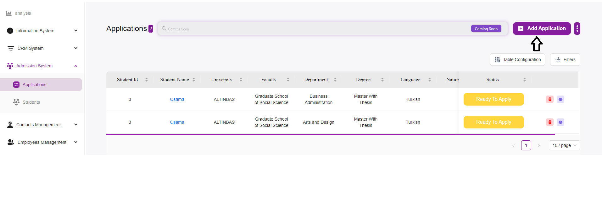
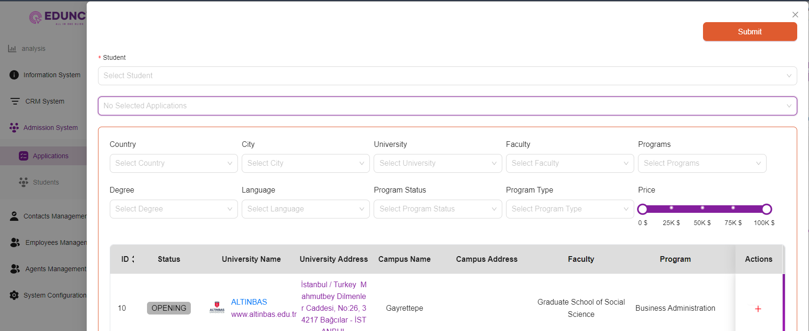

# How to Add a New Application

---

## Access the Applications Page:
- Navigate to the **Admission System** module from the sidebar.  
- Select **“Applications”** to open the applications management page.  

---

## Initiate a New Application:
- Click on the **“+ Add Application”** button located at the top right of the page.  
- This will open a new form where you can enter the details of the application.  

---

## Fill in the Application Details:

### Select Student:
- Click on the **“Select Student”** dropdown menu to choose a student from the list.  
- If the student is not listed, you may need to add the student to the system first.  

### Application Information:
- Select the Application you want, or you can filter and press on the Action **“+”** button.  

### Enter Academic Details:
- **Country:**  
  Select the country where the university is located.  

- **City:**  
  Select the city of the university.  

- **University:**  
  Choose the university to which the student is applying from the dropdown menu.  

- **Faculty:**  
  Select the relevant faculty or school within the university.  

- **Degree:**  
  Select the degree program (e.g., Bachelor’s, Master’s).  

- **Language:**  
  Choose the language of instruction for the program.  

- **Program Status:**  
  Indicate the current status of the program (e.g., Opening, Closed).  

- **Program Type:**  
  Select the type of program (e.g., Full-time, Part-time).  

- **Programs:**  
  Choose the specific program within the faculty.  

### Specify Financial Details:
- **Price:**  
  Use the slider to set the tuition fee for the program. You can adjust the slider to reflect the cost accurately.  

---

## Review and Submit:
- After entering all the necessary information, review the details to ensure accuracy.  
- Click the **“Submit”** button at the top right of the form to save the application.  

---

## Confirmation:
- Once submitted, the application will be listed in the main table on the Applications page.  
- You can now manage and track this application along with others.  

---

## Tips and Best Practices

- **Double-check Details:**  
  Ensure that all details entered are correct and match the student’s academic records.  

- **Update Status:**  
  Regularly update the application status to reflect the current progress.  

- **Use Filters:**  
  Utilize the filter options to sort and manage applications effectively.  

- **Documentation:**  
  Keep any necessary documents ready for upload if required by the system.  
 
