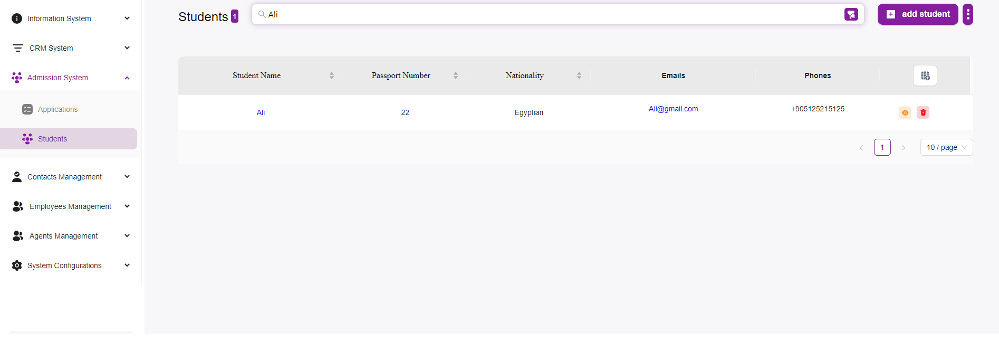
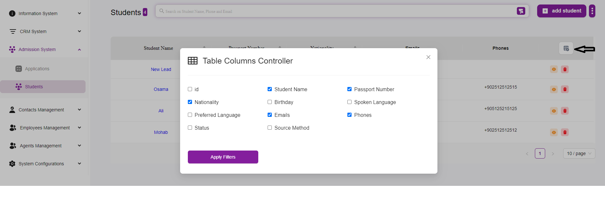

# Students Listing Overview
The Students Page in the Admission System provides a comprehensive interface for managing student information. Below is a detailed overview of its features and functionalities.

## Key Features and Functionalities
### Search Bar:
Located at the top of the page, the search bar allows you to quickly find a student by entering their name or other identifying information.

### Student List:
Displays a table of students with key details including:
- Student Name: The name of the student.
- Passport Number: The passport number of the student.
- Nationality: The nationality of the student.
- Emails: The email address of the student.
- Phones: The phone number of the student.

Each row in the table represents an individual student.  
Note: You can filter the list as you want from the table configuration button

### Actions:
For each student, there are action buttons on the right side of the table:
- View Details: (Eye icon) Allows you to view detailed information about the student.
- Delete: (Trash can icon) Enables you to delete the student record from the system.

### Pagination:
At the bottom right of the table, you can adjust the number of students displayed per page. Options include 5, 10, 15, 20, 25, and 30 students per page.  
Use the navigation arrows to move between pages if there are more students than can be displayed on one page.

### Add Student Button:
Located at the top right of the page, the “+ Add Student” button allows you to add a new student to the system. Clicking this button opens a form where you can enter the student’s details. For more information click Here
