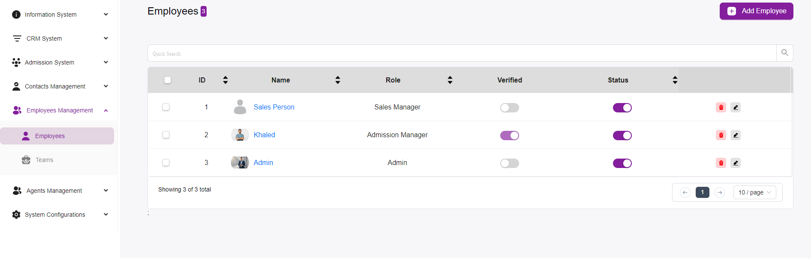

# Employees Listing Overview

The **Employee Page** in the Admission System is designed to manage and view employee information efficiently.  
Here is a detailed overview of its features and functionality.

---

## Layout and Features

### Navigation
The left sidebar contains the navigation menu, allowing users to switch between different sections such as:  
- **Information System**  
- **CRM System**  
- **Admission System**  
- and others  

Within the **Employees Management** section, there are options for:  
- **Employees**  
- **Teams**  

---

### Employee List
The main section displays a list of employees with relevant details in a tabular format.

#### Table Columns
- **ID:** A unique identifier for each employee.  
- **Name:** The name of the employee. Clicking on the name link (e.g., “Sales Person,” “Khaled,” “Admin”) typically takes you to a more detailed profile page for that employee.  
- **Role:** The role of the employee within the organization, such as Sales Manager, Admission Manager, or Admin.  
- **Verified:** A toggle switch indicating whether the employee’s details have been verified.  
  - *Note:* For an employee to be verified after you add them, make sure they receive a confirmation e-mail.  
- **Status:** A toggle switch indicating the employee’s current status (active/inactive).  

---

### Actions
Each employee row has action buttons:  
- **Delete (Trash Icon):** Remove the employee from the system.  
- **Edit (Pencil Icon):** Edit the employee’s details.  

---

### Quick Search
A search bar at the top of the table allows users to quickly find specific employees by typing keywords.  

---

### Pagination
Pagination controls at the bottom right of the table allow users to navigate through pages if there are many employees listed.  
Users can also select the number of entries displayed per page (e.g., 10/page).  

---

### Add Employee
A prominent **“+ Add Employee”** button is located at the top right of the page, enabling users to add new employees to the system.  
