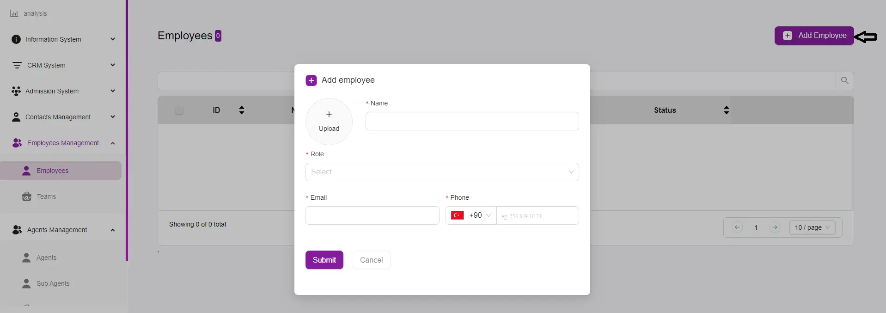

# How to Add a New Employee

## Access the Add Employee Form
Click on the **“+ Add Employee”** button located at the top right corner of the **Employees** page.

## Fill in the Employee Details
- **Upload Photo:** Click the **“+ Upload”** button to add a profile picture for the employee.  
- **Name:** Enter the employee’s full name in the **Name** field.  
- **Role:** Select the appropriate role for the employee from the dropdown menu.  
- **Email:** Enter the employee’s email address in the **Email** field.  
- **Phone:** Enter the employee’s phone number in the **Phone** field. The country code (e.g., +90 for Turkey) is pre-filled, but it can be adjusted if necessary.  

## Submit the Form
Once all the required fields are filled, click the **“Submit”** button to save the new employee’s information.  
If you need to cancel the operation, click the **“Cancel”** button.  

## Verification Process
After the employee’s information is submitted, an email will be sent to the provided email address.  
The employee needs to check their email and follow the instructions to set up their password.  
This step is crucial for the verification process.  

## Employee Verification
The **“Verified”** toggle switch on the **Employees** page will be updated once the employee has successfully set up their password and completed the email verification process.
