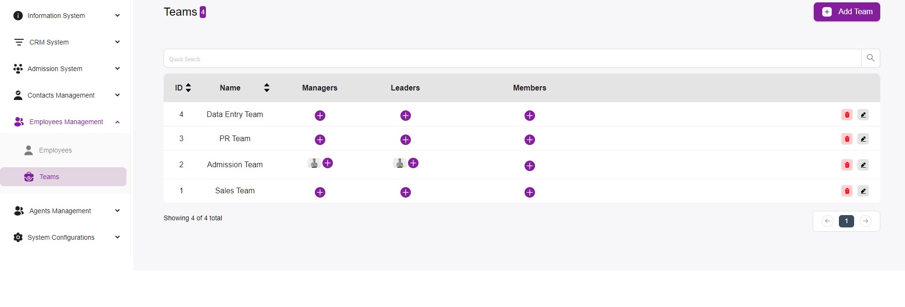
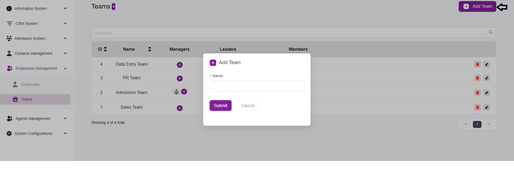

# Teams Listing Overview

The Teams page is a central hub for managing different teams within your organization.  
It allows users to view, add, edit, and delete teams, as well as assign managers, leaders,  
and members to each team.

---

## Key Features

### Team List
Displays all the teams in the system, including their ID, Name, Managers, Leaders, and Members.  
Each team entry provides a quick overview of the team’s composition and management.

### Add Team
Located at the top right corner, the “+ Add Team” button allows you to create a new team.  
Upon clicking, a form will appear where you can enter the new team’s details and assign roles.

### Managers, Leaders, and Members
For each team, you can assign managers, leaders, and members.  
The “+” icons under the respective columns allow you to add individuals to these roles.  
The assigned individuals are displayed with their profile pictures for easy identification.

### Quick Search
The search bar at the top enables you to quickly find a specific team by typing in keywords  
related to the team’s name or other attributes.

### Editing and Deleting Teams
Each team entry has two icons:  
- **Edit (Pencil Icon):** Allows you to modify the team’s details and roles.  
- **Delete (Trash Icon):** Enables you to remove the team from the system.

### Pagination
The pagination controls at the bottom allow you to navigate through the list of teams  
if there are more entries than can fit on one page.  
You can adjust the number of teams displayed per page using the dropdown menu.

---

## Managing Teams

### Adding a Team
1. Click on the “+ Add Team” button.  
2. Fill in the team’s name and assign initial roles such as managers, leaders, and members.  
3. Submit the form to create the team.

### Assigning Roles
1. Click on the “+” icons under Managers, Leaders, or Members to add individuals to these roles.  
2. Select from the list of available employees and save your changes.

### Editing a Team
1. Click on the pencil icon next to the team you wish to edit.  
2. Update the team’s name, roles, and members as needed.  
3. Save your changes to update the team details.

### Deleting a Team
1. Click on the trash icon next to the team you wish to delete.  
2. Confirm the deletion to remove the team from the system permanently.
