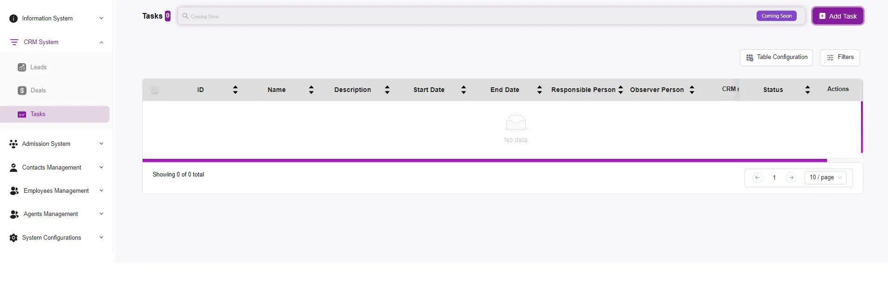
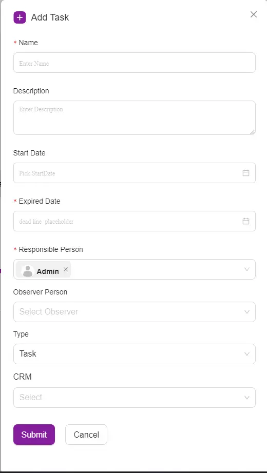
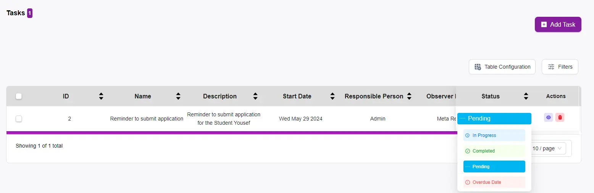

# How to Add a New Task

## Navigate to Tasks:
On the left-hand side menu, under the “CRM System” section, click on “Tasks.”

## Step 2: Open the Add Task Form
**Click Add Task:**  
In the Tasks section, click on the “+ Add Task” button located at the top right of the page. This will open the Add Task form.

## Step 3: Fill Out the Task Details
- **Name:**  
  Enter the name of the task. This should be a brief but descriptive title of what the task entails.

- **Description:**  
  Provide a detailed description of the task. Include any relevant information that will help the assigned person understand what needs to be done.

- **Start Date:**  
  Click on the date picker to select the start date of the task.

- **Expired Date:**  
  Set the deadline for the task by choosing the expired date. This indicates when the task needs to be completed.

- **Responsible Person:**  
  Select the team member responsible for completing the task from the dropdown list.

- **Observer Person:**  
  Choose any team members who should observe the task. These individuals will be kept informed about the task’s progress.

- **Type:**  
  Select the type of task. For example, it could be a follow-up call, meeting, email, etc.

- **CRM:**  
  Choose the relevant CRM entry (if applicable) that this task is associated with. This helps in linking the task to specific contacts, deals, or leads.

## Step 4: Submit the Form
- **Review Entries:**  
  Double-check all the information you’ve entered to ensure it is correct and complete.

- **Submit:**  
  Once you have filled in all the necessary details, click the “Submit” button at the bottom of the form.

- **Confirmation:**  
  A confirmation message will appear, indicating that the task has been successfully added to the system.

## Managing Tasks
- **View and Edit Tasks:**  
  You can view all tasks in the Tasks section. Click on a task to view its details or edit it if necessary.

- **Update Status:**  
  Change the status of a task (e.g., Pending, Completed, Overdue) by clicking on the status indicator next to each task.

- **Delete Tasks:**  
  If a task is no longer needed, you can delete it by clicking the trash bin icon in the Actions column.

## Additional Tips
- **Notifications:**  
  Ensure notifications are set up so responsible and observer persons receive alerts about task deadlines and updates.

- **Filters:**  
  Use the filter options in the Tasks section to quickly find tasks based on status, responsible person, or other criteria.

