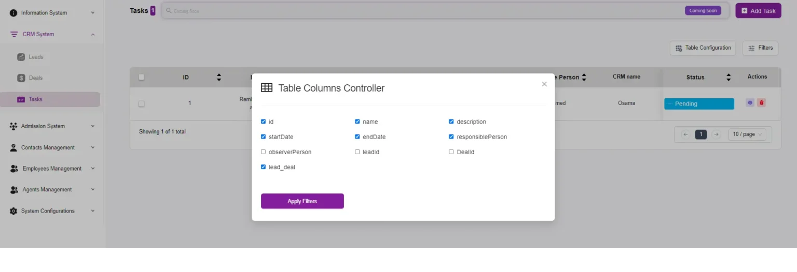

# Tasks Listing Overview

The **Tasks page** in the system is designed to help you manage and track all tasks associated with leads, deals, and other activities within the CRM.  
It provides a centralized location where you can create, view, and update tasks to ensure that all necessary actions are completed in a timely manner.  

Here’s a detailed overview of the functionalities and features available on this page:
!{first image](./TasksListingOverview.webp)
---

## Key Sections

### 1. Tasks Table
The main section of the page displays a table that lists all tasks with the following columns:  
- **ID**: Unique identifier for each task.  
- **Name**: The name or title of the task.  
- **Description**: A brief description of what the task entails.  
- **Start Date**: The date when the task is scheduled to start.  
- **End Date**: The deadline or end date for the task.  
- **Responsible Person**: The individual assigned to complete the task.  
- **CRM Name**: The associated CRM entry (e.g., lead or deal) the task is linked to.  
- **Status**: Current status of the task (*Pending, In Progress, Completed, Overdue Date*).  

---

### 2. Status Update
The **Status** column allows you to quickly update the status of each task through a dropdown menu. Options include:  
- **Pending**: Task is yet to be started.  
- **In Progress**: Task is currently being worked on.  
- **Completed**: Task has been completed.  
- **Overdue Date**: Task is past its deadline.  

---

### 3. Actions
Each task entry has action buttons that allow you to:  
- **Edit**: Modify the details of the task.  
- **Delete**: Remove the task from the list.  

---

### 4. Add Task
- A prominent button at the top right of the page allows you to add a new task.  
- Clicking this button opens a form where you can enter all necessary details, such as:  
  - Name  
  - Description  
  - Start Date  
  - End Date  
  - Responsible Person  
  - Status  

For more info, click **Here**.  

---

### 5. Table Configuration
The **Table Configuration** button allows you to customize the appearance and structure of the tasks table.  
You can:  
- Choose which columns to display.  
- Rearrange their order.  
- Configure other table settings to suit your workflow.  

---

### 6. Filters
The **Filters** button enables you to apply filters to the tasks table, allowing you to quickly find tasks based on specific criteria such as:  
- Status  
- Responsible Person  
- Start Date  
- End Date  
