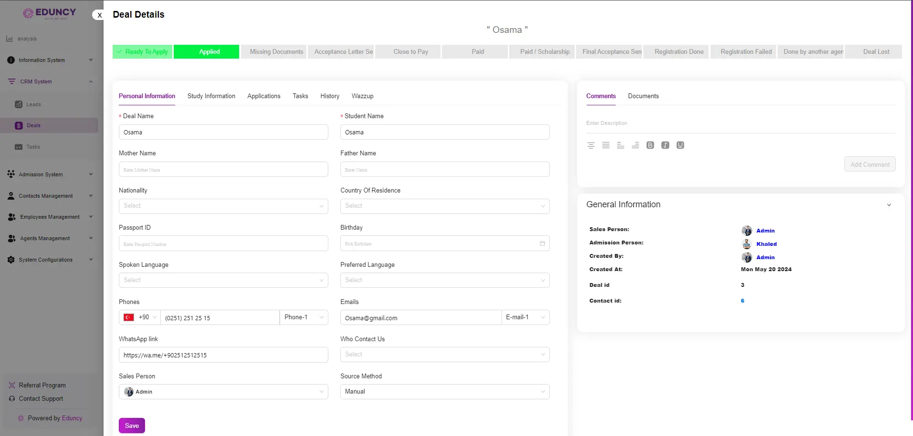

# Deals Details Overview

The Deal Details page System provides a comprehensive view of a specific deal, allowing users to manage and track all related information effectively.  
Here’s a detailed overview of the features and sections available on this page:

---

## Key Sections

### 1. Deal Progress Tabs
At the top of the page, there are several tabs that indicate the stages of the deal:  
- Ready To Apply  
- Applied  
- Missing Documents  
- Acceptance Letter Sent  
- Close to Pay  
- Paid  
- Paid / Scholarship  
- Final Acceptance Sent  
- Registration Done  
- Registration Failed  
- Done by another agent  
- Deal Lost  

---

### 2. Personal Information
This tab contains the primary details of the deal:  
- **Deal Name**: The name of the deal.  
- **Student Name**: The student’s name associated with the deal.  
- **Mother Name, Father Name**: Fields to enter the parents’ names.  
- **Nationality, Country Of Residence**: Dropdowns to select the nationality and country of residence.  
- **Passport ID**: Field to enter the passport number.  
- **Spoken Language, Preferred Language**: Dropdowns to select languages.  
- **Phones**: Phone number(s) associated with the deal.  
- **WhatsApp link**: Link for WhatsApp contact.  
- **Emails**: Email addresses related to the deal.  
- **Who Contact Us, Source Method**: Dropdowns to select how the contact was made and the source method.  

---

### 3. Comments and Documents
On the right side, you have the option to add comments and attach documents:  
- **Comments**: A section to add notes or comments related to the deal.  
- **Documents**: A place to upload and manage documents pertinent to the deal.  

---

### 4. Additional Tabs
- **Study Information**: Store educational details and preferences.  
- **Tasks**: Manage and assign tasks related to the deal, ensuring all follow-ups are tracked.  
- **History**: View a chronological history of interactions and updates related to the deal.  
- **Wazzup**: Quick communication and status updates.  

---

### 5. General Information
- **Sales Person**: The salesperson handling the deal.  
- **Admission Person**: The person responsible for admissions.  
- **Created By**: Name of the user who created the deal entry.  
- **Created At**: Date and time the deal was created.  
- **Deal ID**: Unique identifier for the deal.  
- **Contact ID**: Unique identifier for the contact associated with the deal.  
