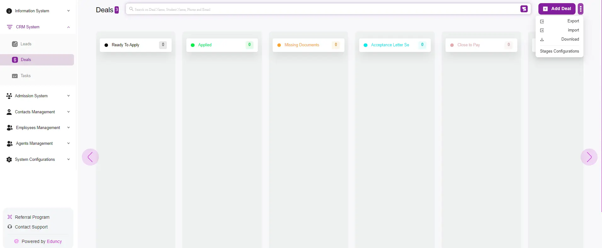

# Deals Listing Overview

The Deals page in the system is designed to help you efficiently manage and track your customers throughout the sales pipeline.  
Here’s a detailed overview of the functionalities and features available on this page:

---

## Main Features

### Deal Stages Kanban Board
- The Deals page is organized as a **Kanban board**, where deals are categorized into different stages:  
  - Ready to apply  
  - Applied  
  - Missing Documents  
  - Paid  
- This visual representation allows you to track the progress of each deal through the sales pipeline at a glance.  

---

### Quick Actions
On the top right corner, there are several quick action buttons:  
- **Add Deal**: Click this button to manually add a new deal to the system. For more info click *Here*.  
- **Export**: Export the list of deals for reporting or backup purposes.  
- **Import**: Import deals from an external source to quickly populate your pipeline.  
- **Download**: Download the details of your deals in a specific format.  
- **Stages Configurations**: Customize the stages of your sales pipeline to fit your business process.  

---

### Deal Information Card
Each deal is represented by a card containing key information:  
- **Name and Timestamp**: Displays the name of the deal and the time it was created.  
- **Contact Methods**: Icons indicating available contact methods (phone, email, WhatsApp).  
- **Source**: Shows how the deal was generated, for example, manually by an admin.  
- **Deal Owner**: Indicates who is responsible for the deal within the system.  

---

### Search and Filter
- The **search bar** at the top allows you to quickly find specific deals by entering keywords such as:  
  - Deal name  
  - Student name  
  - Phone number  
  - Email address  
- The **filter options** enable you to sort and view deals based on different criteria, helping you focus on specific segments of your deal list.  
