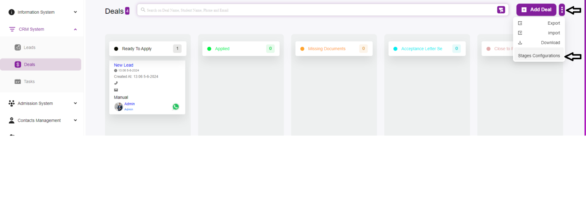

# How to Add Deals Stages

Adding stages to the deals page in your system is essential for tracking the progress of your deals through various phases.  
Here’s a step-by-step guide on how to add stages to the deals page.

---

## Step 1: Navigate to the Deals Stages Page
- Login to your CRM system.  
- Go to the **CRM System** section in the sidebar.  
- Click on **Deals** to open the Deals page.  

---

## Step 2: Open the Add Stage Modal
- On the Deal Stages page, click the **Stage Configurations** button located at the top right corner.  
- This will open the **Add Stage** modal window.  

---

## Step 3: Fill in Stage Details
In the Add Stage modal, you will see the following fields:  
- **Name**: Enter the name of the new stage (e.g., *Ready to Apply*, *Applied*, *Missing Documents*).  
- **Color**: Select a color to visually distinguish this stage.  

---

## Step 4: Submit the New Stage
- After entering the necessary details, click the **Submit** button to save the new stage.  
- To cancel, click **Cancel** to close the modal without saving.  

---

## Step 5: Verify the New Stage
- The newly added stage should now appear in the list of deal stages.  
- Verify that the stage is correctly listed with its name and color.  

---

## Additional Management Options
- **Edit Stage**: Click the edit icon next to a stage to update its details.  
- **Delete Stage**: Click the delete icon to remove a stage no longer needed.  
- **Reorder Stages**: Some CRM systems allow drag-and-drop to reorder stages according to your workflow.  
