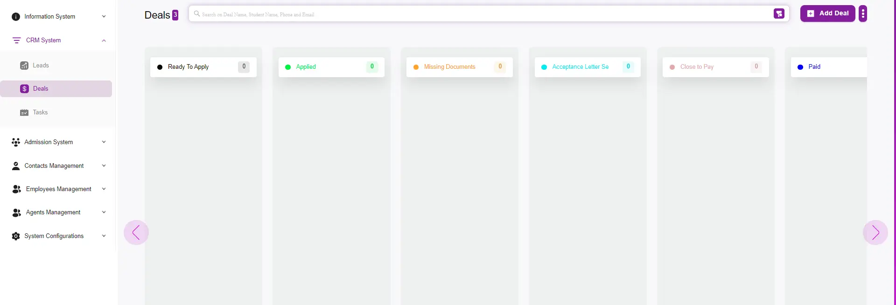

# How to Add a New Deal

---

## Step 1: Go to the CRM System
- Navigate to the **Deal** tab.  

---

## Step 2: Add a Deal
- Click the **Add Deal** button.  

---

## Step 3: Fill Out the Deal Information
Fill out the deal details, including:  
- **Deal Name**  
- **Email Address**  
- **Phone Number**  
- **Funnel Stage** (sales pipeline stage)  
- **Sales Person** (assigned to follow up with the lead/deal)  
- **Source Method** (where the deal came from)  

---

## Step 4: Submit
- Finally, click **Submit** or **Submit & Open**.  
