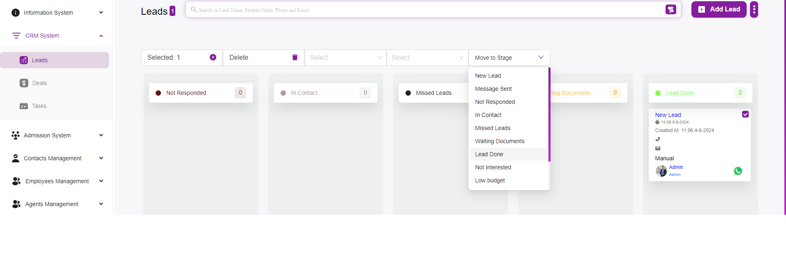
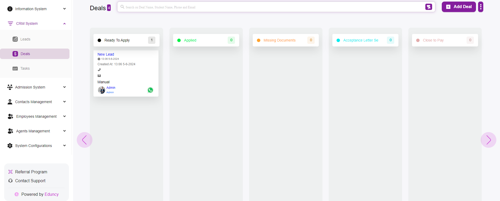

# How to Convert Lead to Deal

Converting a lead to a deal in your system is a crucial step in the sales process.  
Here’s a step-by-step guide on how to convert a lead to a deal, specifically when the lead reaches the **“Lead Done”** stage.  
You can also move leads to different stages by dragging and dropping them.

---

## Step 1: Navigate to the Leads Page
- Login to your system.  
- Go to the **CRM System** section in the sidebar.  
- Click on **Leads** to open the Leads page.  

---

## Step 2: Identify the Lead to Convert
- On the Leads page, you will see different columns representing various stages of the lead process (e.g., *New Lead*, *Message Sent*, *Not Responded*, etc.).  
- Locate the **lead card** you want to convert. Leads are represented by cards within these columns.  

---

## Step 3: Move the Lead to Different Stages

### Drag and Drop Method
1. Click and hold the lead card you want to move.  
2. Drag the card to any column.  
3. Release the mouse button to drop the card into the stage you want.  

### Move to Stage Dropdown Method
1. Select the lead by clicking the **checkbox** on the lead card.  
2. Click on the **Move to Stage** dropdown menu at the top of the page.  
3. Select the stage from the dropdown options.  

---

## Step 4: Convert the Lead to a Deal

- Once the lead is in the **“Lead Done”** stage, it indicates that the lead is ready to be converted to a deal.  

**Automatic Conversion**  
- Moving a lead to the **“Lead Done”** stage automatically converts it to a deal.  

**Manual Conversion**  
1. Click on the lead card in the **“Lead Done”** stage to open its detailed view.  
2. Look for an option to **Convert to Deal** or **Mark as Deal**.  
3. Click on this option to convert the lead to a deal.  

---

## Step 5: Verify the Conversion
- Go to the **Deals** section in the CRM system.  
- Verify that the converted lead now appears as a deal in this section.  

---

## Additional Tips

### Drag and Drop Flexibility
- You can drag and drop lead cards between any stages to update their status.  
- This feature allows for easy and quick management of leads as they progress through different stages.  

### Stage Management
- Regularly review and update stages to ensure leads are correctly categorized based on their current status.  
