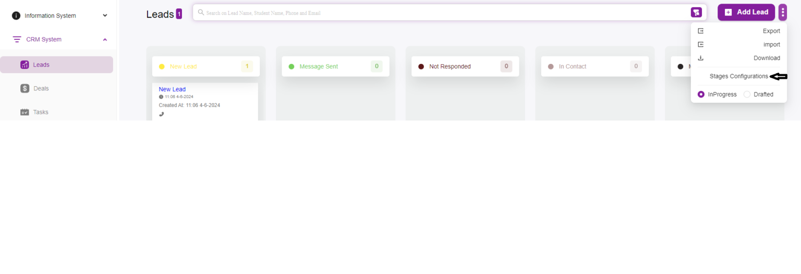
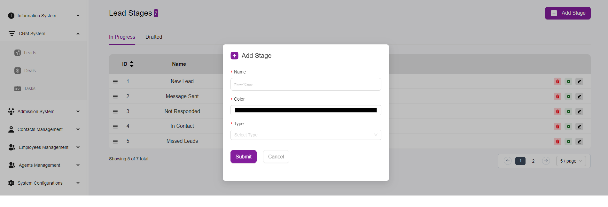

# How to Add Leads Stages

Adding Stage Configurations in your system helps you track and manage leads efficiently by defining various stages they go through.  
Here’s a step-by-step guide on how to add stage configurations:

---

## Step 1: Navigate to the Lead Stages Page
- Login to your CRM system.  
- Go to the **CRM System** section in the sidebar.  
- Click on **Leads**.  

---

## Step 2: Access the Add Stage Form
- On the Lead page, locate the **Stage Configurations** button, typically found on the top right of the page.  
- Click on the **Stage Configurations** button.  
- This will open a form to add a new stage.  

---

## Step 3: Fill Out the Add Stage Form
In the form that appears, provide the following information:  

- **Name**:  
  Enter the name of the stage (e.g., *New Lead*, *Message Sent*, *Not Responded*).  

- **Color**:  
  Click on the color field to choose a color that will represent this stage. This helps visually distinguish between different stages.  

- **Type**:  
  Select the type of stage. Options typically include:  
  - *In Progress*: For stages that are currently active or ongoing.  
  - *Drafted*: For stages that are being planned or are in draft form.  

---

## Step 4: Save the New Stage
- After filling out all the necessary fields, click on the **Save** button to add the new stage to your lead stages list.  

---

## Additional Actions on Lead Stages Page

- **Edit a Stage**:  
  To edit an existing stage, click on the *pencil icon* next to the stage you want to modify. This will open the form with the current details of the stage, allowing you to make necessary changes.  

- **Delete a Stage**:  
  To delete an existing stage, click on the *trash bin icon* next to the stage you want to remove. Confirm the deletion when prompted.  

- **Configure Stage Settings**:  
  Click on the *gear icon* next to a stage to configure additional settings if available.  
