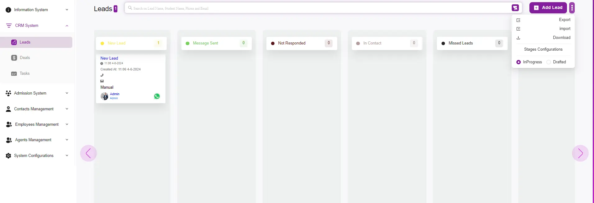

## Leads Listing Overview  

The Leads page in the system is designed to help you efficiently manage and track  
potential customers throughout the sales pipeline.  
Here’s a detailed overview of the functionalities and features available  
on this page.  

---

---

### Main Features  

📌 **Lead Stages Kanban Board**  
The Leads page is organized as a Kanban board, where leads are categorized  
into different stages:  

- New Lead  
- Message Sent  
- Not Responded  
- In Contact  
- Missed Leads  

This visual representation allows you to track the progress of each lead  
through the sales pipeline at a glance.  

---

⚡ **Quick Actions**  
On the top right corner, there are several quick action buttons:  

- **Add Lead** → Click this button to manually add a new lead to the system.  
- **Export** → Export the list of leads for reporting or backup purposes.  
- **Import** → Import leads from an external source to quickly populate your pipeline.  
- **Download** → Download the details of your leads in a specific format.  
- **Stages Configurations** → Customize the stages of your sales pipeline  
  to fit your business process.  
- **Toggle InProgress/Drafted** → Switch between viewing leads that are  
  actively in progress or in a drafted state.  

---

🗂️ **Lead Information Card**  
Each lead is represented by a card containing key information:  

- **Name and Timestamp** → Displays the lead’s name and creation time.  
- **Contact Methods** → Icons for available contact methods (phone, email, WhatsApp).  
- **Source** → Shows how the lead was generated (e.g., manually by an admin).  
- **Lead Owner** → Indicates who is responsible for the lead within the system.  

---

🔍 **Search and Filter**  
The search bar at the top allows you to quickly find specific leads by entering  
keywords such as:  

- Lead name  
- Student name  
- Phone number  
- Email address  

