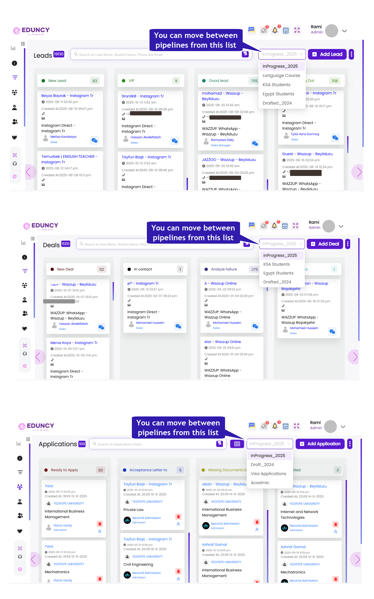

# 🎯 Pipelines → New Feature for Leads, Deals & Applications  
### Organize Your Workflows Your Way!

---

## What’s New  
We’ve introduced a powerful new **Pipelines** feature in **Eduncy CRM** that lets you fully customize how you manage **Leads, Deals, and Applications** —  
each with its own independent workflows.  

This update gives your team more control, flexibility, and visibility —  
making it easier than ever to adapt the CRM to your exact business process.  

---

## Full Feature Overview  
Managing **Leads, Deals, and Applications** just got a major upgrade!  
With the new **Pipelines** feature, you can now design and manage multiple, independent process flows  
tailored to your organization’s structure — all from a clean, unified settings page.  

---

## Here’s What’s New  

### ✅ Unified Access to Pipeline Settings  
Access Pipelines directly from the **three-dot menu (⋮)** on each page —  
**Leads, Deals, or Applications → [Page Name] Settings.**  
The Pipelines page now opens directly, displaying all pipelines, their stages, and actions.  

---

### ✅ Custom Pipelines for Each Workflow  
Create dedicated pipelines for different services, markets, or academic years —  
like separate pipelines for **Language Course Leads** vs. **University Admission Leads**,  
or **Applications 2025** vs. **Applications 2026.**  

---

### ✅ Flexible Stage Management  
Add, rename, reorder, color-code, or delete stages to reflect your real business process.  
In **Leads**, you can also set a stage as the **End of Process**, triggering a smart popup when a lead reaches it —  
allowing users to either **Convert to Deal** or **Transfer to Another Pipeline** seamlessly.  

---

### ✅ Effortless Reordering & Default Control  
Drag and drop pipelines or stages to reorder them by priority.  
The system automatically assigns new records to your **Default Pipeline**,  
keeping everything consistent and organized across modules.  

---

### ✅ Bulk Actions for Efficiency  
Easily move multiple **Leads, Deals, or Applications** between pipelines in just a few clicks —  
ideal for high-volume operations or seasonal campaigns.  

---

### ✅ Smart Conversion Flow (Leads → Deals)  
When a **Lead** reaches its **End-of-Process Stage**, a popup appears allowing users to:  

- **Convert to Deal** — choose the target Deal Pipeline and Stage.  
- **Transfer to Pipeline** — move the lead to another lead pipeline and stage.  

This ensures smooth transitions between sales stages without losing data or context.  

---

### ✅ Unified Permissions & Settings Access  
All pipeline configurations are managed from the **Settings** of each module (**Leads, Deals, or Applications**).  
Only users with proper access rights can **create, edit, or delete** pipelines —  
ensuring secure and consistent management.  

---

✨ This update makes **Eduncy CRM** more intuitive, flexible, and scalable —  
giving education teams total control over every stage of their workflow,  
from first contact to enrollment.  

---

## 📘 Learn More  
For step-by-step instructions, explore our detailed guides:  

- [How to Use Leads Pipelines](#)  
- [How to Use Deals Pipelines](#)  
- [How to Use Applications Pipelines](#)
